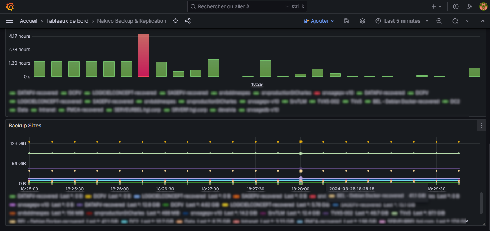
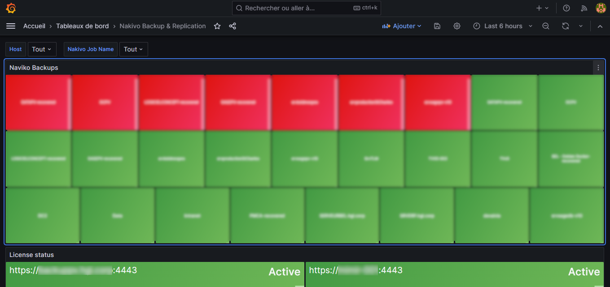

[](https://opensource.org/licenses/GPL-3.0)
[](http://isitmaintained.com/project/netinvent/nakivo_prometheus_exporter "Percentage of issues still open")
[](https://github.com/netinvent/nakivo_prometheus_exporter/latest)
[](https://github.com/netinvent/nakivo_prometheus_exporter/actions/workflows/pylint-linux.yaml)

## Nakivo Prometheus exporter

This tool connects to Navkio Backup & Replication API endpoints, and fetches licensing and backup  information in order to present this data as prometheus metrics that can be pulled via a `/metrics` endpoint.

## Compatibility

This project has been tested on Nakivo Backup & Replication v9 and v10.  
It runs on most Linux flavors that have Python 3.6+, and can even run on Windows.

## Grafana dashboard

The exporter comes with a basic Grafana Dashboard, showing:
- Licensing status
- Backup states for objects of per job
- Backup sizes
- Backup durations




## Quick start

Grab yourself a copy of `nakivo_prometheus_exporter` by running
```
python3 pip install nakivo_prometheus_exporter
```

Create your YAML config file in let's say `/etc/nakivo_prometheus_exporter.yaml`
```
http_server:
  listen: 0.0.0.0
  port: 9119
  username: me
  password: MySecret!Password
  # We usually don't authenticate for prometheus exporters
  no_auth: true
  log_file: /var/log/nakivo_prometheus_exporter.log
nakivo_hosts:
  - MyNakivoHost:
    host: https://mynakivohost.tld:4443
    username: readonly
    password: SomeNicePassword
    cert_verify: False
  - AnotherNakivoHost:
    host: https://othernakivo.local:4443
    username: readonly
    password: OtherPasswrod
    cert_verify: True
```

Once you're done, you can try to run the exporter with
```
nakivo_prometheus_exporter --config-file=/etc/nakivo_prometheus_eporter.yaml
```
Once running, you might want to check the metrics with:
```
curl http://localhost:9119/metrics
```

If everything works, you can use the provided systemd service file, copy it into `/etc/systemd/system` and run the service with
```
systemctl enable --now nakivo_prometheus_exporter
```

## Caveats

Since on every scraping, the exporter connects to *ALL* Nakivo API endpoints defined in the host section, you should set the scraper interval to something reasonable like 1 hour.

## Other caveats

This is a quick and dirty proof of concept, only fetching  backup states/duration/sizes and licensing state.  
There's still quiescing information missing (didn't find it in the (Nakivo API)[https://helpcenter.nakivo.com/api-reference/Content/API-Reference-Overview.htm])

If some traction is obersved for the project, we might add missing or interesting metrics.

## Running on Windows

While this typically targets Linux, one can run this exporter on Windows, as single threaded instance without concurrency.
Running as service can be achieved via nssm.

## Like it ?

Write us ;)